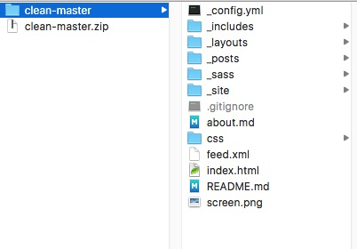
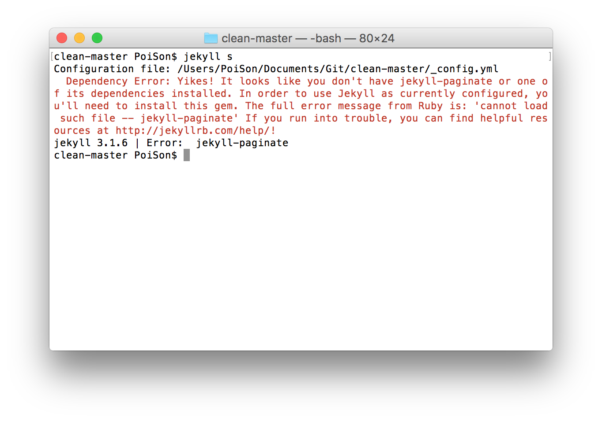
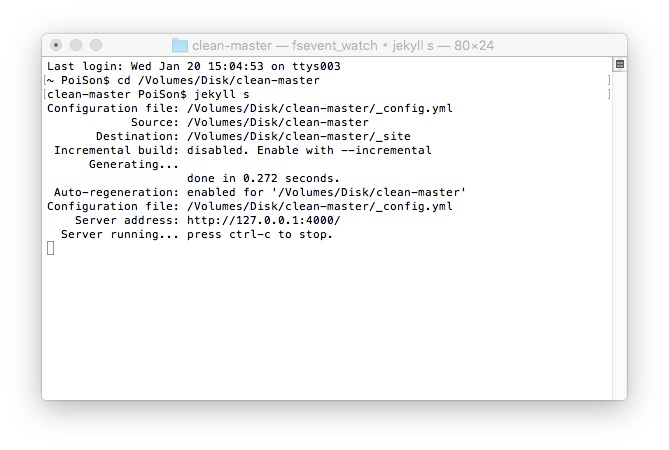
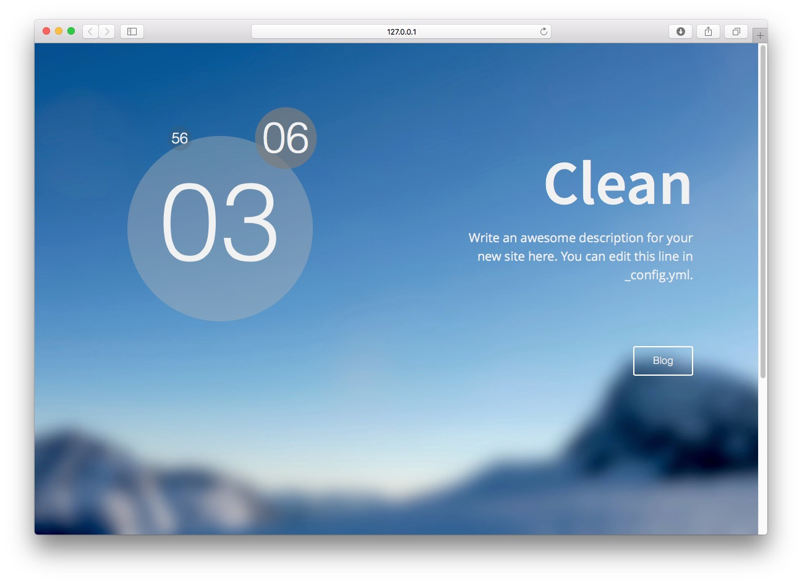
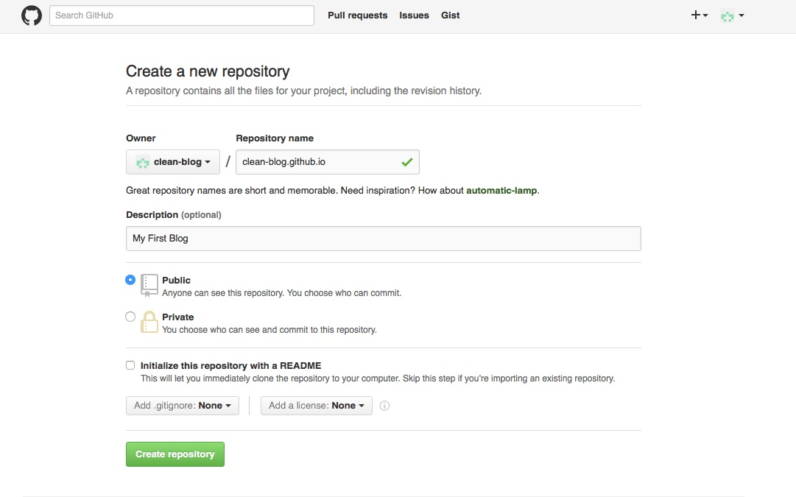
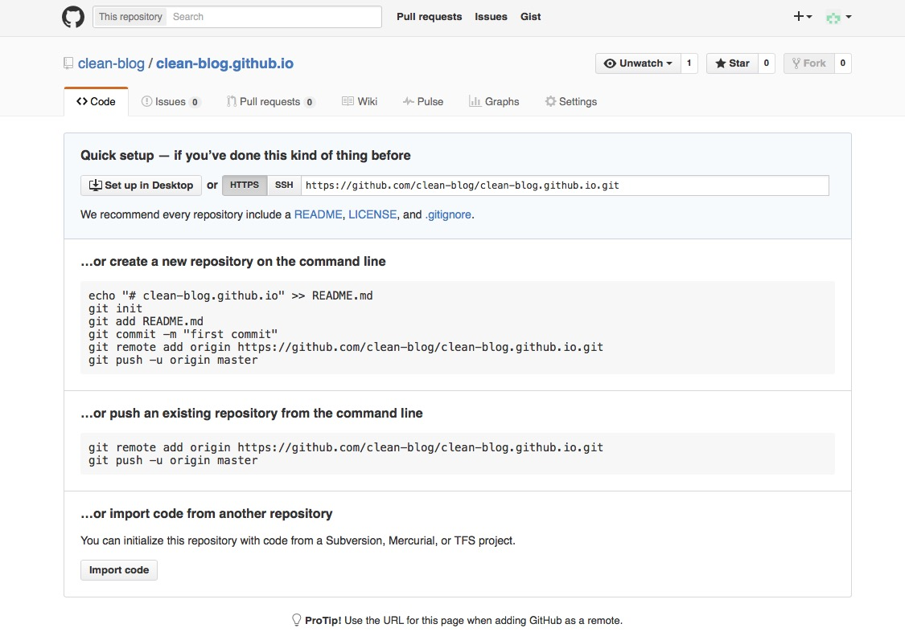
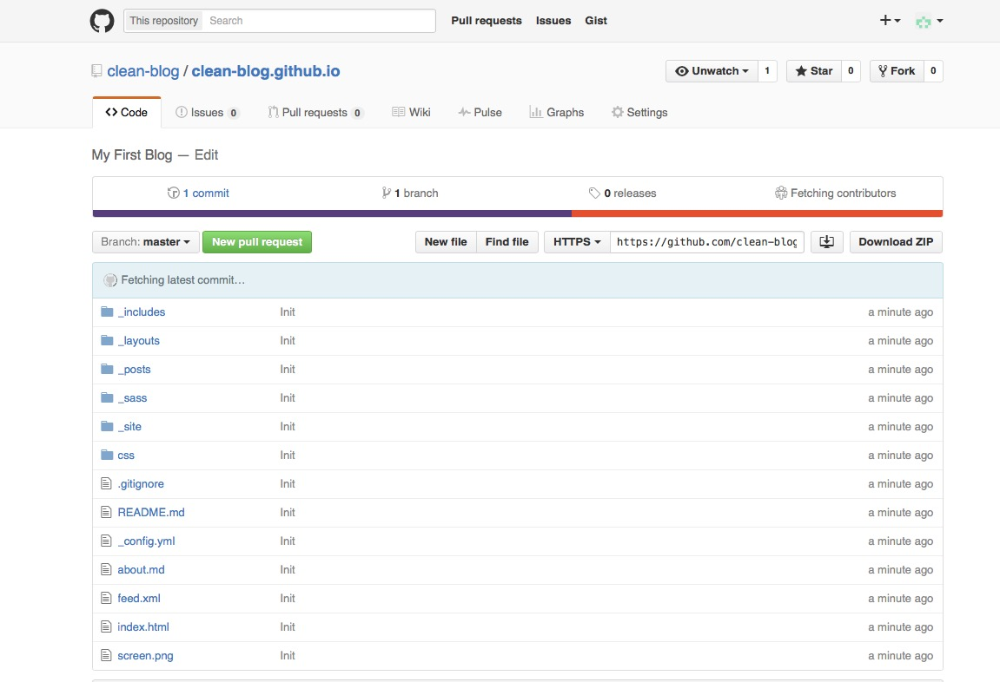
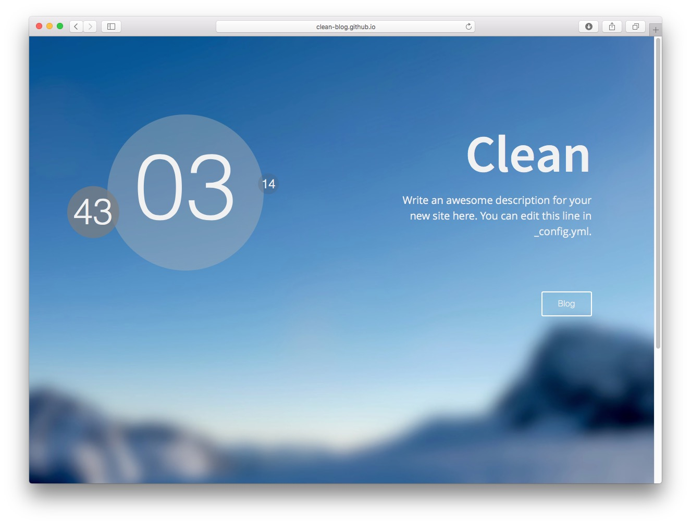

　　这篇blog主要用于记录怎么在Mac下使用[pages.github.com](http://pages.github.com)和[jekyll](https://jekyllrb.com)布署个人博客。
##步骤
　　首先，我们先在本地布署一个博客，调试完毕之后再上传到服务器。
###关闭Rootless
　　Mac 10.11之后，苹果为系统加入了一个叫做`Rootless`的权限工具，用于保护系统的目录不被修改、写入。ruby和jekyll的部份插件需要一些权限，所以需要临时关闭这个功能。

　　重启，开机时按住Command+R，进入恢复模式。打开终端，输入：

```
csrutil disable
```
　　重新启动就可以了。完成配置jekyll之后，如果你对系统的安全感到担忧，可以将Rootless功能打开，只需要将上面的命令改成`csrutil enable`即可。
###配置ruby

　　我使用的是Mac 10.11，系统自带了ruby等工具，所以可以跳过安装ruby、gem这些步骤(Mac果然是程序员的利器)。

　　将gem的sources替换成国内镜像，以提升速度。在终端中输入：

```ruby
$ gem sources --add https://ruby.taobao.org/ --remove https://rubygems.org/

$ gem sources -l
*** CURRENT SOURCES ***

https://ruby.taobao.org
#确保只有ruby.taobao.org
```
###安装Jekyll
　　在终端中输入：

```ruby
##此命令需要输入你的用户密码
$ sudo gem install jekyll

##安装完了之后，查看版本号
$ jekyll -v
```
　　至此，你已经成功地在本地安装好了Jekyll。
###下载漂亮的博客主题
　　赏心悦目的博客才有心思用心经营下去。不懂Html，不懂css，不懂Javascript，怎么编写漂亮的博客？没关系，Jekyll上面有很多非常漂亮的博客模板。[地址](http://jekyllthemes.org)

　　你是不是已经被那些漂亮的主题冲昏了脑袋，已经在想像中自己的博客也像这样美轮美奂？那么现在我们就去实现它，在Jekyll模板列表里，选取一个漂亮的模板，这里拿[clean](http://jekyllthemes.org/themes/clean/)来做例子，点击`Download`下载到本地。

　　解压后，目录如下:

　　

###本地布署博客
　　我们需要对博客做一些初步的修改。用文本编辑器打开_config.yml，主要修改baseurl属性和markdown属性。修改如下

```ruby
# Site settings
title: Clean
email: your-email@domain.com
description: > # this means to ignore newlines until "baseurl:"
  Write an awesome description for your new site here. You can edit this
  line in _config.yml.
#把根目录改成空
baseurl: "" # the subpath of your site, e.g. /blog/
url: "http://yourdomain.com" # the base hostname & protocol for your site
twitter_username: jekyllrb
github_username:  jekyll

# Build settings
#把markdown的解译器改成redcarpet,并添加一些插件以支持更多markdown语法
markdown: redcarpet
redcarpet:
  extensions: ["fenced_code_blocks", "tables"]
gems: [jekyll-paginate]
```
　　改完_config.yml之后，保存。打开终端，然后进入该目录，输入

```ruby
#进入博客的本地目录
$ cd ....../clean-master

#Jekyll开始服务
$ jekyll s
```
　　如果很不幸，你不能启动jekyll，并报了类似以下的错误，这是因为你缺少了博客需要的一些组件。



　　因此你需要安装一些组件，使用gem可以很方便地安装这些组件。

```ruby 
$ sudo gem install jekyll-paginate
```

　　如果你的终端与我的显示似类，那么恭喜你，你已经完成了本地博客的布署了。



　　赶快打开你的浏览器，输入[http://127.0.0.1:4000/](http://127.0.0.1:4000/)看看效果！



###布署到服务器
　　仅仅只是在本地看看博客，肯定不能满足你骚动的心，你想要向世界展示你的才华，那么你需要一个服务器来托管你的博客。很幸运，GitHub免费为你提供了这项服务。

　　[点击这里](http://www.github.com)，注册你的GitHub帐户。注册完毕后，我们可以来继续我们的博客设置了。

　　点击`+ New repository`，像以下这样填写你的信息。`Repository name`有格式要求，必须是`Owner.github.io`，这个Owner就是你的用户名，在图中你也可以找到Owner，我的帐户里，clean-blog就是Owner，所以我使用clean-blog.github.io作为我的设置。Description可以随意填。



　　点击Create repository，创建代码仓库。



　　到这里，你其实已经拥有了GitHub为你提供的博客空间。你需要做的就是将你的博客放到这里来。将刚才的clean-blog目录下的东西提交到GitHub的仓库下。



　　然后在新的浏览器里，打开`Owner.github.io`（我的是clean-blog.github.io），你会惊喜地发现，你的博客已经布署到网络中了。至此，你也有了你的个人博客了！
　　


###使用个性域名来访问你的博客
　　博客这么个性的东西，怎么能不配上你个性的域名呢？现在域名也比较便宜。我是在[阿里云](http://wanwang.aliyun.com)上买的域名。你也可以在其它域名运营商里购买你喜欢的域名。域名购买的过程就不累述了，我们直接开始设置如何将你的个性域名指向到你的博客中。

　　在你的域名解析里，添加以下两条记录，指向pages.github.io的服务器。


　　回到你的本地博客目录中，新建一个文件，名为CNAME（文件名叫CNAME，没有文件后缀），内容为你的域名。比如我的CNAME的内容如下

```
yerl.cn
```
　　保存后，使用`GitHub Desktop`Commit你做的修改，并Sync到你的代码仓库里。然后你就可以使用你的域名来访问你的博客了。是不是很酷？